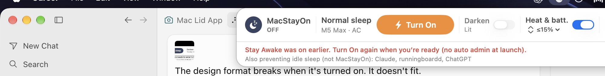

<p align="center">
  
</p>

<p align="center">
  <strong>MacStayOn</strong><br>
  <sub>Menu bar control for closed-lid stay awake — built for long agent runs</sub>
</p>

<p align="center">
  <a href="https://github.com/markadebartolo/MacStayOn/releases/latest"><strong>Download for Mac (Apple Silicon)</strong></a>
  &nbsp;·&nbsp;
  <a href="https://github.com/markadebartolo/MacStayOn/releases">All releases</a>
</p>

<p align="center">
  
  
  
  
</p>

<p align="center">
  
</p>

---

## Why MacStayOn

Close the lid and keep working — **Cursor, Claude, builds, and other agents** can keep running without an external display. MacStayOn lives in the **menu bar** (no Dock icon). One tap turns stay-awake on; turn it off and **normal lid sleep** comes back.

> **Safety first:** A closed Mac can overheat in a bag or under a blanket. MacStayOn warns you before enabling and can **turn itself off** on low battery or serious heat. On a fanless **MacBook Air** or **MacBook Neo**, the Turn On warning also advises shorter closed-lid sessions.

---

## Get started (macOS)

1. Download **[MacStayOn-macos-arm64.zip](https://github.com/markadebartolo/MacStayOn/releases/latest)** from Releases.
2. Unzip and open **MacStayOn.app** (notarized builds open normally; no right-click workaround needed).
3. Click the **moon** icon in the menu bar.
4. Tap **Keep awake with lid closed** → confirm the heat warning → approve **admin once** with **Touch ID** when offered (or password) so MacStayOn can block lid sleep on battery.
5. Close the lid when you are ready. Open it again and MacStayOn asks whether to **restore normal sleep** or stay on.

### Who can use the download

| | |
|--|--|
| **Works on** | **Apple Silicon** Macs (M1, M2, M3, M4, …) · **macOS 13 Ventura** or later |
| **File** | `MacStayOn-macos-arm64.zip` — **arm64 only** (not a universal / Intel build) |
| **Best on** | MacBook / MacBook Pro / MacBook Air (lid close is the main use case) |
| **Also OK** | Desktop Apple Silicon Macs if you still want stay-awake / no-screensaver — no lid flash or lid-open prompt |
| **Not for** | **Intel Macs**, Windows, or older macOS (12 and below) |

**Lid-angle sensor** (orange flash while closing past ~85°) is only on newer MacBooks that have that hardware. Older Apple Silicon MacBooks without it still get full stay-awake; they just skip the flash.

Not sure which chip you have? Apple menu → **About This Mac** — look for **Chip** (e.g. Apple M2). If it says **Intel**, this download will not run.

---

## The menu panel

The popover matches what you see in the app — status first, then one primary action, then guards and session info.

| Section | What it does |
|--------|----------------|
| **Header** | MacStayOn name and **ON** / **OFF** pill |
| **Status** | *Lid closed: normal sleep* or *Lid closed: stays awake* · machine (e.g. MacBook Pro · M5 Max) · AC or battery % |
| **Primary button** | **Keep awake with lid closed** (orange) or **Restore normal sleep** when on |
| **Heat & battery guard** | Toggle + *Restore normal sleep at* **10–50%** battery. Also turns off if macOS reports **serious heat**. Only while MacStayOn is on. |
| **Lid-close flash** | While On, closing the lid past ~85° pulses the screen orange until the lid is fully shut (or reopened). Needs a lid-angle sensor; skipped quietly on Macs without one. |
| **This session** | Time awake (always visible). Expand to see apps that were working, timeline, and **Clear last session**. Collapsed by default. |
| **Quit** | Restores sleep settings and exits |

Session data stays **on your Mac** — nothing is sent to a server.

---

## What happens under the hood

| When you turn **On** | When you turn **Off** or **Quit** |
|----------------------|-----------------------------------|
| `pmset disablesleep` (**admin once** — Touch ID when offered) + IOKit stay-awake + **no screensaver** | A root watchdog restores normal lid sleep — **no password** in the usual case |
| Works on **battery** without a monitor | If the watchdog was killed, Off asks for admin to clear stuck sleep — **Off never leaves SleepDisabled on** (bag-safety) |

`PreventSystemSleep` alone is not enough on battery; MacStayOn uses the same approach power users rely on for closed-lid work.

---

## Build from source

Developers and contributors:

```bash
brew install xcodegen
chmod +x scripts/build.sh
./scripts/build.sh
open dist/MacStayOn.app
```

Open in Xcode: `xcodegen generate && open MacStayOn.xcodeproj`

**Sign & notarize** (for your own Developer ID): see **[docs/DISTRIBUTE-MAC.md](docs/DISTRIBUTE-MAC.md)**.

---

## Verify (optional)

```bash
pmset -g | grep disablesleep    # 1 while On
pmset -g assertions | grep -i MacStayOn
spctl -a -vv dist/MacStayOn.app # Notarized Developer ID (after notarize.sh)
```

---

<p align="center">
  <sub>Menu bar · Local session analytics · Notarized macOS builds on Releases</sub>
</p>
